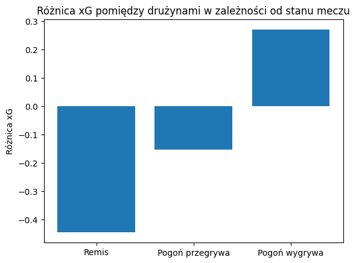

# Zadanie 1
1.⁠ ⁠Oblicz różnicę xG (expected goals) dla każdego stanu meczu (wygrana-przegrana-remis) dla obu drużyn.

Nie byłem pewny, jakie dokładnie liczby są ode mnie oczekiwane, dlatego zwróciłem się z prośbą o doprecyzowanie, czy chodzi o różnicę między drużynami, czy między stanami meczu wewnątrz jednej drużyny. Odpowiedź wskazywała, żebym wybrał wariant, który lepiej odpowiada na pytanie "co to mówi sztabowi trenerskiemu" i uzasadnił wybór jednym zdaniem.
### Wybrałem wariant z różnicą xG między drużynami dla każdego stanu meczu

## Wybór metryki xG zamiast Execution xG
Wybór podyktowałem tym, że liczyło się dla mnie stwarzane zagrożenie, a nie jakość samych strzałów (a Execution xG bierze pod uwagę również kierunek i siłę strzału), dlatego zdecydowałem się na klasyczny model xG.

## Metodologia
1. Filtrowanie po `mecz["event_type_name"] == "Shot"`.
2. Odkrycie problemu: każdy strzał zawiera dane `freeze_frame`, przez co powielony jest około 18 razy, bo każdy wiersz to lokalizacja jednego zawodnika w momencie strzału.
3. Dodatkowy filtr `mecz["freeze_frame_player_id"].isna() == True` zostawia tylko wiersz z danymi strzału, eliminując pozostałe 17.
4. Weryfikacja: `strzaly["id"].nunique()` jest równe `strzaly["id"].count()` oraz ręczne sprawdzenie timestampów pozwala stwierdzić, że błąd był naprawiony.
5. Budowa kolumny `gole`: `.apply()`, 1, kiedy padł gol dla Pogoni, -1 kiedy padł gol dla Polonii, 0 w przypadku strzału bez gola.
6. Metoda `.cumsum()` pozwala na zrobienie kolumny śledzącej wynik `stan_meczu`
7. Budowa kolumny `korzysc`: `.apply()`, "Pogoń wygrywa" dla `stan_meczu` > 0, "Pogoń przegrywa" dla `stan_meczu` < 0, "Remis" dla `stan_meczu` = 0.
8. Agregacja `.groupby(["korzysc", "possession_team_name"]).agg({"statsbomb_xg":"sum", "event_type_name":"count"})`.
9. Zastosowanie `.pivot()` dla zrobienia tabeli przestawnej, aby przekształcić tabelę.
10. Zliczenie różnicy xG.

## Napotkane anomalie w danych
Przed filtrowaniem `mecz["freeze_frame_player_id"].isna() == True` było 628 eventów o `event_type_name = "Shot"` oraz 79 eventów z `outcome_name = "Goal"`, zdecydowanie za dużo jak na jeden mecz. 
Po filtrowaniu były już tylko 34 strzały i 4 gole zgadzające się pod względem czasu z prawdziwymi wydarzeniami z meczu.
Dodatkowo weryfikowałem po `match_id`, czy to na pewno jeden mecz.

## Wyniki i ich ograniczenia

Remis: -0.444653

Pogoń przegrywa: -0.152081

Pogoń wygrywa: 0.270911

Ograniczenia: stan w którym Pogoń wygrywała bądź przegrywała był na tyle krótki, że oddane zostały w sumie kolejno 4 oraz 3 strzały, więc wnioski przez tak małą próbę należy traktować orientacyjnie. Z kolei w stanie remisu zostało oddane w sumie 27 strzałów, co wynika z tego, że okres ten trwał najdłużej.

## Uzasadnienie wyboru wariantu

Zdecydowałem się na wariant z różnicą xG pomiędzy drużynami, ponieważ obie wartości zliczane są w tych samych ramach czasowych, co od razu daje nam oczyszczoną wartość bez potrzeby normalizacji tego ze względu na różnice w długości trwania stanów. Co ważniejsze, wybranie tego wariantu daje **sztabowi trenerskiemu** gotowe liczby do porównania, bez mieszania okresów.